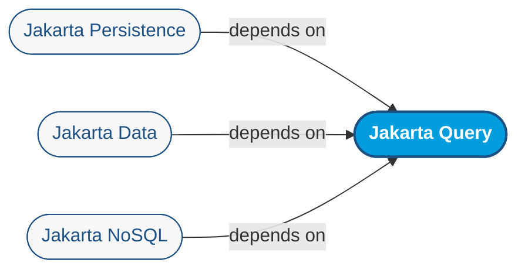
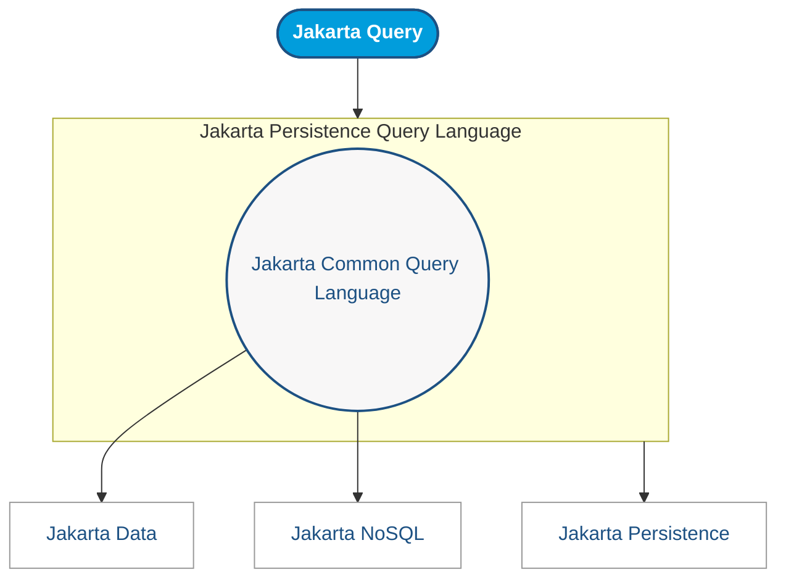
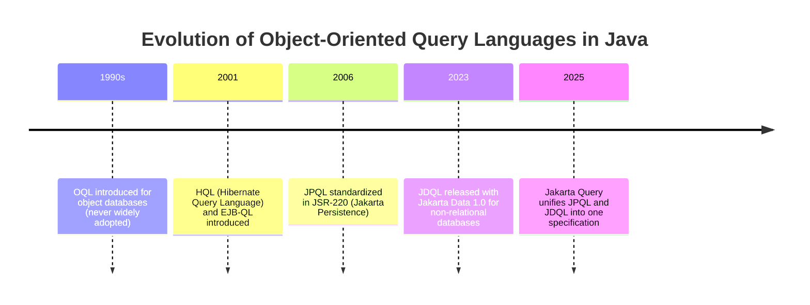

# Jakarta Query


[Jakarta Persistence]: https://jakarta.ee/specifications/persistence/
[Jakarta Data]: https://jakarta.ee/specifications/data/
[Jakarta NoSQL]: https://jakarta.ee/specifications/nosql/
[Java Persistence Query Language]: https://jakarta.ee/specifications/persistence/3.2/jakarta-persistence-spec-3.2#a4665
[Jakarta Data Query Language]: https://jakarta.ee/specifications/data/1.0/jakarta-data-1.0#_jakarta_data_query_language
[JSR-220]: https://jcp.org/en/jsr/detail?id=220

Jakarta Query serves as a unifying specification that provides a common object-oriented query language for the Jakarta ecosystem. It establishes a shared foundation that can be used consistently across [Jakarta Persistence][], [Jakarta Data][], and [Jakarta NoSQL][], ensuring that developers rely on a single query model rather than separate, independently evolving languages.



To accommodate the diversity of datastores in the Jakarta ecosystem, Jakarta Query distinguishes between two levels of query language: a common subset, designed for use by [Jakarta Data][] and [Jakarta NoSQL][] providers targeting non-relational databases, and a superset tailored for [Jakarta Persistence][] and other providers working with relational technologies.

- a common query language that can be implemented by Jakarta Data and Jakarta NoSQL
  providers using non-relational datastores, and 
- additional capability in a query language tailored for Jakarta Persistence providers
  or other persistence technologies backed by relational databases.

> ⚠️ **Note**  
> While [Jakarta Data][] primarily targets the Jakarta Common Query Language, it may also support
> the Jakarta Persistence Query Language if its implementation is based on [Jakarta Persistence][].

The query languages defined by Jakarta Persistence 3.2 and Jakarta Data 1.0 were
contributed to the Jakarta Query specification as the basis for the Jakarta Query,
which remains fully backward compatible with both specifications.



Jakarta Query prioritizes clients written in Java. However, it is not by 
nature limited to Java, and implementations in other sufficiently Java-like 
programming languages are encouraged.

## Object-oriented query languages

A data structure in an object-oriented language is a graph of objects 
interconnected by unidirectional object references, which may be polymorphic. 
Some non-relational databases support similar representations. On the other 
hand, relational databases represent relationships between entities using 
foreign keys, and therefore SQL has no syntactic construct representing 
navigation of an association. Similarly, inheritance and polymorphism can be 
easily represented within the relational model, but are not present as 
first-class constructs in the SQL language. An object-oriented query language 
is a dialect of SQL with support for associations and subtype polymorphism.

## Historical background

Object-oriented dialects of SQL have existed since at least the early 90s. 
The Object Query Language (OQL) was an early example, targeting object 
databases, but was never widely used, since object databases were themselves 
not widely adopted. Hibernate Query Language (HQL) and the Enterprise JavaBeans 
Query Language (EJB-QL) were both introduced in 2001 as query languages 
intended for use with object/relational mapping. HQL was widely adopted by the 
Java community and was eventually standardized as the [Java Persistence Query 
Language][] (JPQL) by [JSR-220][] in 2006. JPQL has been implemented by at 
least five different products and is in extremely wide use today. On the other 
hand, since JPQL is defined as part of the Jakarta Persistence specification, 
it has not been reused outside the context of object/relational mapping in Java. 
More recently, Jakarta Data 1.0 introduced the [Jakarta Data Query Language][] 
(JDQL), a strict subset of JPQL intended for use with non-relational databases. 
It is now inconvenient that JDQL and JPQL are maintained separately by different 
groups, and so the Jakarta Query project has taken on responsibility for their 
evolution.



## Language Levels in Jakarta Query  

### Jakarta Common Query Language

The **Common language** focuses on a core set of operations that are common across most data access technologies: operations such as selection, restriction, ordering, and simple projection. To illustrate, consider the following JSON representation of a `Room` document:

```json
{
  "id": "R-101",
  "type": "DELUXE",
  "status": "AVAILABLE",
  "number": 42
}
````

Using the Comnon language, a query might retrieve all deluxe rooms that are available, ordered by their number:

```sql
from Room where type = 'DELUXE' and status = 'AVAILABLE' order by number
```

### Jakarta Persistence Query Language

The **Persistence language** is a superset of the Common language defined by the Jakarta Query specification. It introduces SQL-oriented constructs such as joins, grouping, and bulk updates or deletes, which are especially useful in relational contexts. For example, imagine a `Hotel` document with an embedded list of rooms:

```json
{
  "id": "H-200",
  "name": "Grand Hotel",
  "rooms": [
    { "id": "R-101", "status": "OCCUPIED" },
    { "id": "R-102", "status": "OCCUPIED" },
    { "id": "R-103", "status": "AVAILABLE" }
  ]
}
```

With the Persistence language, a query could count the number of occupied rooms per hotel, returning only those with more than ten:

```sql
select h.name, count(r)
from Hotel h join h.rooms r
where r.status = 'OCCUPIED'
group by h.name
having count(r) > 10
order by count(r) desc
```

### Language Levels and Feature Summary

This subsection summarizes the differences between the syntax defined in the [Jakarta Common Query Language grammar] and the [Jakarta Persistence Query Language grammar].

> **Note**  
> In the following tables:
> * Yes = Feature available at this level
> * No  = Feature not available at this level

#### Clauses and Constructs

| Feature / Construct                               | Common | Persistence |
|---------------------------------------------------|--------|-------------|
| `FROM` clause                                     | Yes    | Yes         |
| `WHERE` clause                                    | Yes    | Yes         |
| `ORDER BY` clause                                 | Yes    | Yes         |
| `SELECT` paths/id/count                           | Yes    | Yes         |
| Update (`UPDATE ... SET`)                         | Yes    | Yes         |
| Delete (`DELETE FROM`)                            | Yes    | Yes         |
| Joins (inner/left/fetch)                          | No     | Yes         |
| Grouping (`GROUP BY`)                             | No     | Yes         |
| Having (`HAVING`)                                 | No     | Yes         |
| Aggregate functions (`SUM`, `AVG`, `MIN`, `MAX`)  | No     | Yes         |
| Distinct in `SELECT`                              | No     | Yes         |
| Constructor expressions                           | No     | Yes         |
| Subqueries (`EXISTS`, `IN`, `ALL`, `ANY`, `SOME`) | No     | Yes         |
| Set operations (`UNION`, `INTERSECT`, `EXCEPT`)   | No     | Yes         |

#### Special Expressions and Functions

##### Datetime Expressions

| Expression                                    | Common | Persistence |
|-----------------------------------------------|--------|-------------|
| `LOCAL DATE`, `LOCAL TIME`, `LOCAL TIMESTAMP` | Yes    | Yes         |
| `EXTRACT(field FROM x)`                       | No     | Yes         |

##### Boolean Expressions

| Expression               | Common | Persistence |
|--------------------------|--------|-------------|
| Literals `TRUE`, `FALSE` | Yes    | Yes         |
| `EXISTS`                 | No     | Yes         |

##### Numeric Expressions

| Expression                   | Common | Persistence |
|------------------------------|--------|-------------|
| Basic operators (+, -, *, /) | Yes    | Yes         |
| `ABS`                        | Yes    | Yes         |
| `MOD`                        | No     | Yes         |
| `ROUND`                      | No     | Yes         |

##### String Expressions

| Expression                 | Common | Persistence |
|----------------------------|--------|-------------|
| `\|\|` concatenation       | Yes    | Yes         |
| `LENGTH`                   | Yes    | Yes         |
| `LOWER`, `UPPER`           | Yes    | Yes         |
| `LEFT`, `RIGHT`            | Yes    | Yes         |
| `LOCATE`                   | No     | Yes         |
| `SUBSTRING`                | No     | Yes         |
